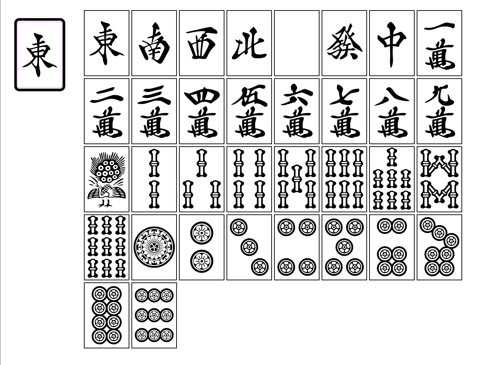
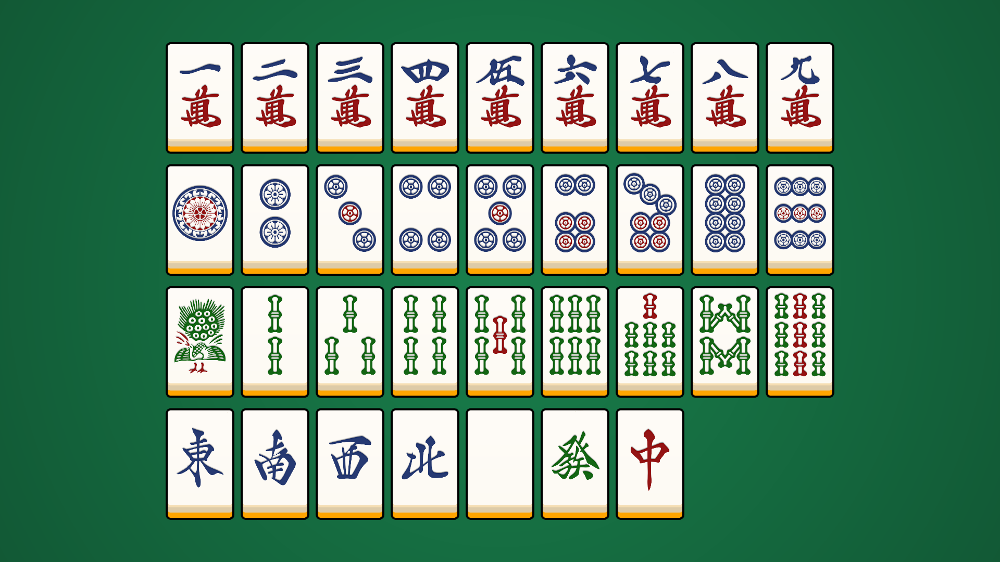

# MahjongTileTool

## MahjongTileExporter

麻雀牌フォントを使用し、牌の画像を PNG 形式で保存するプログラムです。

- 使用フォント: [GL-MahjongTile](https://github.com/Gutenberg-Labo/DingbatFonts)

## Demo

上記 MahjongTileExporter で出力した画像を使用して描画するサンプルプログラムです。

## 開発環境

- Visual Studio 2022 / 2026
- Siv3D v0.6.16

## ライセンス

このリポジトリに含まれるソースコードは MIT License のもとで公開しています。

フォントデータについては、配布元が定めるライセンスに従ってください。
